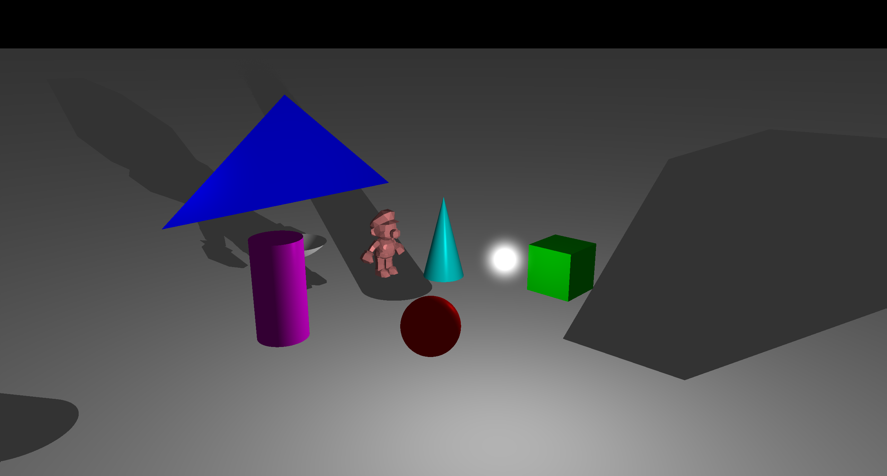
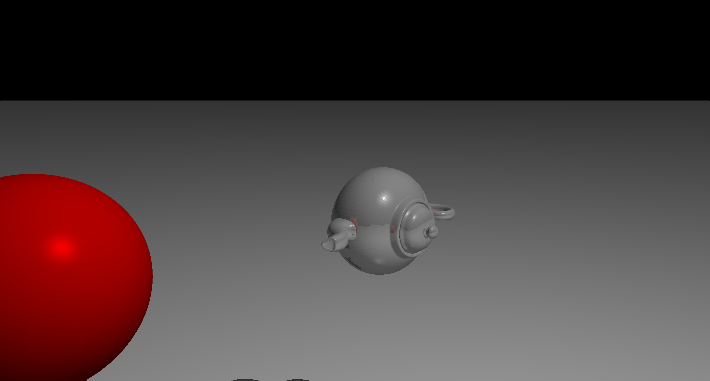
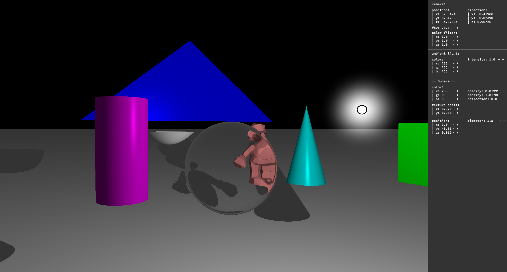
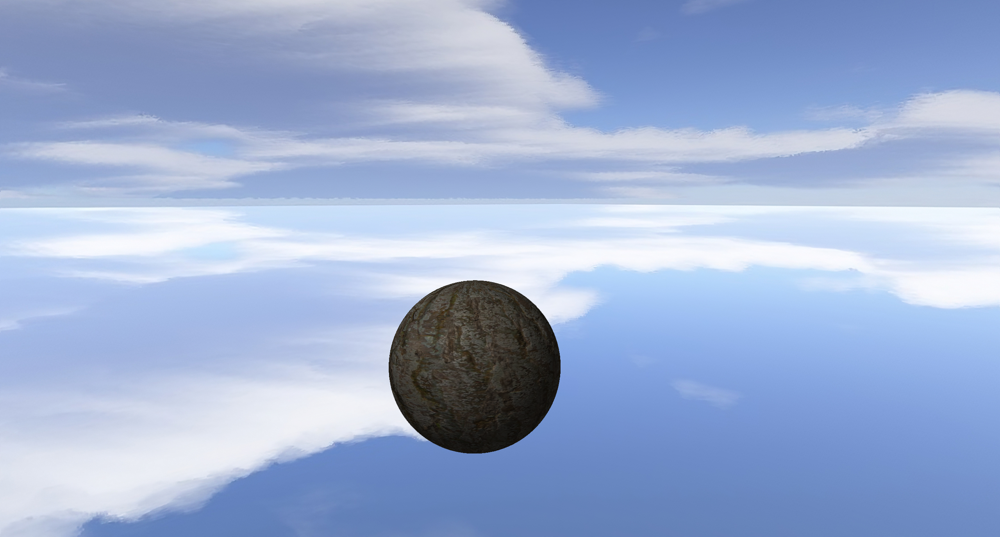
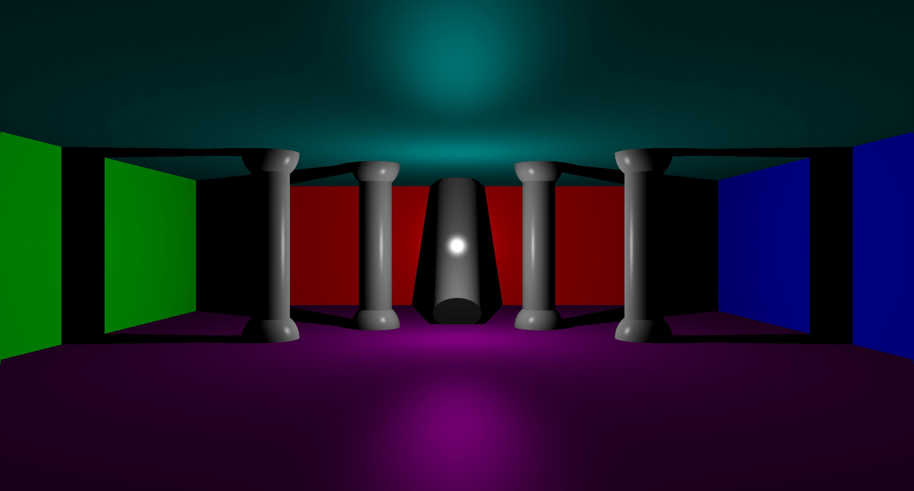
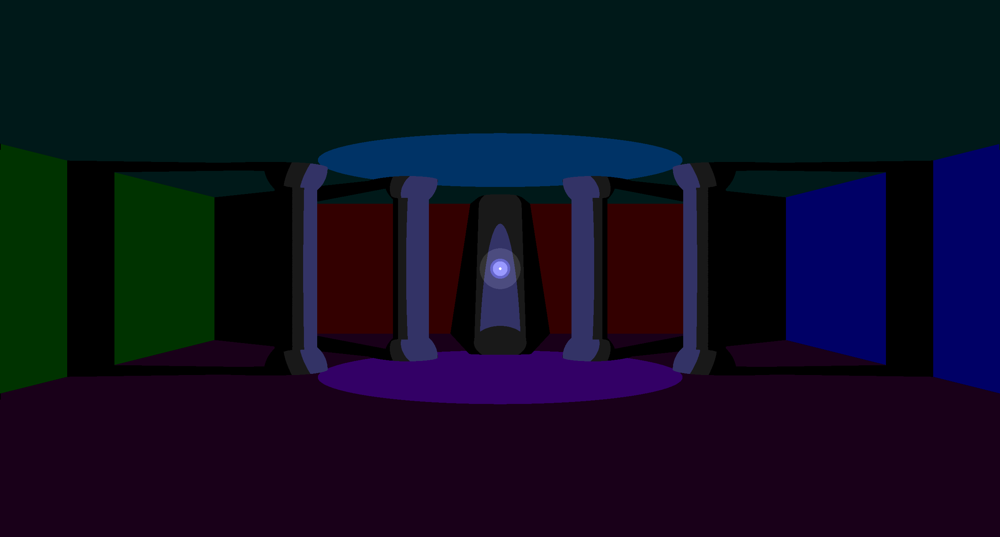
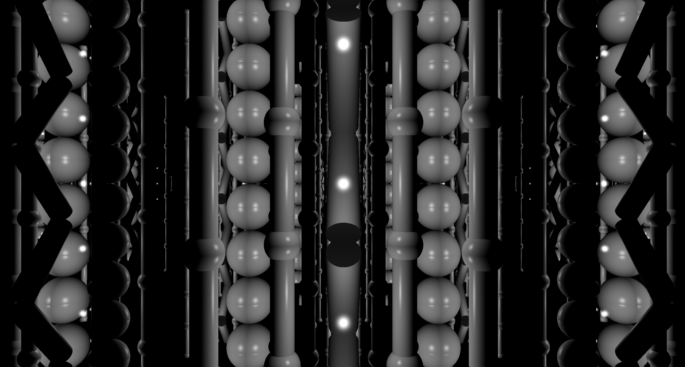

# maxiRT — Advanced Ray Tracer

<p align="center">
  <strong>Ray tracer haute fidélité avec optiques avancées</strong><br>
  Projet graphique de l'école 42 | C • CPU Ray Tracing
</p>

---

## 📖 Vue d'ensemble

**maxiRT** est un ray tracer complet en temps réel implémenté en C pur, capable de générer des images en utilisant la technique du lancer de rayons (ray tracing). Ce projet explore les techniques avancées de rendu 3D et d'optique physiquement réaliste.

Contrairement aux moteurs de rasterization temps réel (OpenGL, Vulkan), le ray tracing simule fidèlement le trajet de la lumière pour obtenir un réalisme visuel inégalé : réflexions, réfractions, ombres, ...

**Philosophie** : Rendu CPU haute qualité — Chaque pixel est calculé par simulation physique de la lumière.

---

## 🖼️ Screenshots


*Tous les objets compris dans maxiRT*


*Reflexion partielle sur théière*


*Refraction d'une sphère et menu visible*


*Skybox et texture avec normal map*


*Scene complexe*


*Scene complexe avec l'effet cartoon*


*Scene complexe avec tous les murs qui sont des miroirs*

---

## ✨ Fonctionnalités

### Partie obligatoire

- ✅ **Objets géométriques primitifs** — Sphère, plan, cylindre, cône (équations mathématiques)
- ✅ **Transformations 3D** — Translation, rotation pour tous les objets
- ✅ **Caméra configurable** — Position et orientation ajustables
- ✅ **Gestion de la lumière** — Spots multiples, intensité variable, ombres portées
- ✅ **Brillance (specular)** — Effet de shine (reflets spéculaires)

### Options implémentées

- 🌅 **Lumière ambiante** — Illumination globale de base
- ☀️ **Lumière directionnelle** — Lumière parallèle (soleil)
- 💡 **Lumière ponctuelle** — Sources de lumière localisées
- 🔲 **Objets limités** — Parallélogrammes, disques, demi-sphères, tubes
- 🗺️ **Bump mapping** — Relief simulé via perturbation de normales
- 🎨 **Perturbation de couleur** — Textures procédurales (damier, bruit)
- 📄 **Fichiers de scène externes** — Chargement de scènes depuis fichiers .rt
- 🪞 **Réflexion** — Miroirs, surfaces métalliques
- 💎 **Transparence** — Verre, liquides (réfraction)
- 🌫️ **Ombres modifiées** — Ombres selon transparence (caustiques basiques)
- 🧊 **Objets composés** — Cubes, pyramides, tétraèdres (CSG)
- 🖼️ **Textures** — Mapping de textures sur objets (UV mapping)
- 🎭 **Textures conditionnelles** — transparence selon texture

### Bonus avancés

- ⚡ **Multi-threading** — Calcul parallèle sur plusieurs cœurs CPU
- 📸 **Anti-aliasing (MSAA)** — Supersampling pour éliminer l'aliasing
- 🌌 **Skybox / Environment mapping** — Ciel HDRI pour éclairage réaliste
- 📊 **Export de vidéo** — AVI (ffmpeg)
- 🚀 **Temps réel** — Diminution de la résolution adaptatif pour avoir un rendu en temps réel lors des déplacements

---

## 🎮 Utilisation

### Compilation

Prérequis : **GCC**, **Make**

```bash
# Cloner le dépôt
git clone https://github.com/agtdbx/maxiRT.git
cd maxiRT

# Compiler le projet
cmake -B build; cmake --build build

# Lancer le ray tracer avec une scène
export LD_LIBRARY_PATH=lib/ffmpeg
./rt scene/file.rt
```

### Exemple de fichier de scène (.rt)
```rt
# Camera
C 0,0,20 0,0,-1 70

# Ambient light
A 0.2 255,255,255

# Light
L -40,40,30 0.6 255,255,255

# Sphere (center, radius, color)
sp 0,0,0 5 255,0,0

# Plane (point, normal, color)
pl 0,-5,0 0,1,0 200,200,200

# Cylinder (center, axis, diameter, height, color)
cy 10,0,0 0,1,0 4 10 0,255,0
```

### Format de fichier de scène (.rt)

#### Lignes obligatoires et uniques
Caméra
```rt
C <position> <direction> <fov>
```

Lumière Ambiante
```
A <intensité> <couleur>
```

#### Lignes optionnelles et uniques
Skybox
```rt
S <texture>
```

#### Lignes optionnelles
Sphère
```rt
sp <position> <diamètre> <couleur>
sp-ck <position> <diamètre>
sp-sn <position> <diamètre>
sp-pn <position> <diamètre>
sp-t <position> <diamètre> <texture>
sp-tn <position> <diamètre> <texture> <normal map>
```

Plan
```rt
pl <position> <direction> <couleur>
pl-ck <position> <direction>
pl-sn <position> <direction>
pl-pn <position> <direction>
pl-t <position> <direction> <texture>
pl-tn <position> <direction> <texture> <normal map>
```

Cylindre
```rt
cy <position> <direction> <diamètre> <hauteur> <couleur>
cy-ck <position> <direction> <diamètre> <hauteur>
cy-sn <position> <direction> <diamètre> <hauteur>
cy-pn <position> <direction> <diamètre> <hauteur>
cy-t <position> <direction> <diamètre> <hauteur> <texture>
cy-tn <position> <direction> <diamètre> <hauteur> <texture> <normal map>
```

Cône
```rt
co <position> <direction> <diamètre> <hauteur> <couleur>
co-ck <position> <direction> <diamètre> <hauteur>
co-sn <position> <direction> <diamètre> <hauteur>
co-pn <position> <direction> <diamètre> <hauteur>
co-t <position> <direction> <diamètre> <hauteur> <texture>
co-tn <position> <direction> <diamètre> <hauteur> <texture> <normal map>
```

Cube
```rt
cu <position> <direction X> <direction Y> <largeur> <hauteur> <profondeur> <couleur>
cu-ck <position> <direction X> <direction Y> <largeur> <hauteur> <profondeur>
cu-sn <position> <direction X> <direction Y> <largeur> <hauteur> <profondeur>
cu-pn <position> <direction X> <direction Y> <largeur> <hauteur> <profondeur>
cu-t <position> <direction X> <direction Y> <largeur> <hauteur> <profondeur> <texture>
cu-tn <position> <direction X> <direction Y> <largeur> <hauteur> <profondeur> <texture> <normal map>
```

Triangle
```rt
tr <point> <point> <point> <couleur>
tr-ck <point> <point> <point>
tr-sn <point> <point> <point>
tr-pn <point> <point> <point>
tr-t <point> <point> <point> <texture>
tr-tn <point> <point> <point> <texture> <normal map>
```

Objet 3D en fichier .obj
```rt
ob <position> <direction X> <direction Y> <taille> <fichier obj> <couleur>
ob-ck <position> <direction X> <direction Y> <taille> <fichier obj>
ob-sn <position> <direction X> <direction Y> <taille> <fichier obj>
ob-pn <position> <direction X> <direction Y> <taille> <fichier obj>
ob-t <position> <direction X> <direction Y> <taille> <fichier obj> <texture>
ob-tn <position> <direction X> <direction Y> <taille> <fichier obj> <texture> <normal map>
```

Parabole
```rt
par <position> <direction> <hauteur> <couleur>
par-ck <position> <direction> <hauteur>
par-sn <position> <direction> <hauteur>
par-pn <position> <direction> <hauteur>
par-t <position> <direction> <hauteur> <texture>
par-tn <position> <direction> <hauteur> <texture> <normal map>"
```
#### Lignes spéciales
Ajoute un effet cartoon
```rt
cartoon
```

Commentaire
```rt
# <ce que tu veux>
```

### Contrôles

| Touche              | Fonction                                             |
|---------------------|------------------------------------------------------|
| **Echap**           | Quitter                                              |
| **Tab**             | Ouvrir/fermer le menu                                |
| **R (appuie long)** | Lancer/arrêter le vidéo (indicateur en bas à gauche) |
| **WASD/ZQSD**       | Mouvement                                            |
| **Espace/Lshift**   | Monter/Descendre                                     |
| **Lctrl**           | Sprint                                               |
| **Flèches**         | Tourner la caméra                                    |

Une fois le menu ouvert, vous pouvez cliquer sur l'objet que vous souhaite pour le modifier.
---

## 🧮 Aspects techniques

### Algorithme de ray tracing

Le ray tracing fonctionne en **inversant** le trajet de la lumière :

1. **Génération de rayons primaires** — Un rayon par pixel, depuis la caméra
2. **Intersection rayon-objet** — Résolution d'équations mathématiques (quadriques)
3. **Calcul d'éclairage** — Modèle de Phong (ambiant + diffus + spéculaire)
4. **Rayons secondaires** — Réflexion, réfraction (récursif, max depth 16)
5. **Ombres** — Shadow rays vers chaque lumière (occlusion)

### Intersections géométriques

Chaque primitive a son équation d'intersection :

- **Sphère** : \((P - C) \cdot (P - C) = r^2\) → équation quadratique
- **Plan** : \((P - P_0) \cdot N = 0\) → intersection linéaire
- **Cylindre** : Équation implicite du cylindre infini + clipping hauteur
- **Cône** : Équation du cône infini + clipping

### Optique physique

- **Loi de Snell-Descartes** : Réfraction \(n_1 \sin \theta_1 = n_2 \sin \theta_2\)
- **Équation de Fresnel** : Coefficient de réflexion selon l'angle (eau, verre)
- **Beer-Lambert** : Absorption de la lumière dans les milieux transparents
- **Modèle de Phong** : \(I = I_a + I_d (\mathbf{N} \cdot \mathbf{L}) + I_s (\mathbf{R} \cdot \mathbf{V})^n\)

### Optimisations

- **Bounding Volume Hierarchy (BVH)** — Arbre de boîtes englobantes (AABB)
- **Multi-threading** — 1 thread par région de l'image (tiles)
- **Early exit** — Arrêt si rayon sort de la scène
- **Cache de calculs** — Normales, UV mapping pré-calculés

### Gestion de mémoire

- **Structures données C** — Malloc/free, pas de fuite mémoire (Valgrind clean)
- **Pool d'objets** — Allocation en bloc pour éviter fragmentation
- **Parsing robuste** — Validation complète des fichiers .rt

---

## 📂 Structure du projet

```text
maxiRT/
├── imgs/               # Images pour les scènes fournies
├── lib/                # Contient les dépendences nécessaires
├── maps/               # Fichiers de scène .rt
├── obj/                # Fichiers .obj pour les scènes fournies
├── readme-data/        # Images pour le readme
├── srcs/               # Code source C
├── CMakeLists.txt      # Compilation
└── README.md           # Ce fichier
```

---

## 🎯 Objectifs pédagogiques (42)

Ce projet de l'école 42 vise à maîtriser :

- ✅ **Algorithmes de rendu 3D** — Ray tracing, intersections, éclairage
- ✅ **Mathématiques 3D** — Vecteurs, matrices, équations de surfaces
- ✅ **Optique géométrique** — Réflexion, réfraction, loi de Fresnel
- ✅ **Programmation C avancée** — Structures, pointeurs, parsing, gestion mémoire
- ✅ **Optimisation** — Multi-threading, BVH, cache

---

## 📦 Dépendances

- **GCC 9.0+** (C99 ou C11)
- **Cmake**

---

## 📚 Ressources utiles

- [Équations d'intersection](https://hugi.scene.org/online/hugi24/coding%20graphics%20chris%20dragan%20raytracing%20shapes.htm)
- [Équation de Fresnel](https://en.wikipedia.org/wiki/Fresnel_equations)
- [Format des .obj](https://paulbourke.net/dataformats/obj/)
- [Ray Tracing in One Weekend (Peter Shirley)](https://raytracing.github.io/)
- [Super vidéo sur le ray tracing](https://www.youtube.com/watch?v=Qz0KTGYJtUk)

---

## 📜 License

Projet pédagogique école 42 — Usage éducatif uniquement.

---

## 👥 Auteurs

**Auguste Deroubaix** (agtdbx) 🔗 [GitHub](https://github.com/agtdbx) • 🎓 Étudiant 42</br>
**dguillau** (damienglld) 🔗 [GitHub](https://github.com/damienglld) • 🎓 Étudiant 42</br>
**Thibaut Dubois** (thibautdbs) 🔗 [GitHub](https://github.com/thibautdbs) • 🎓 Étudiant 42
